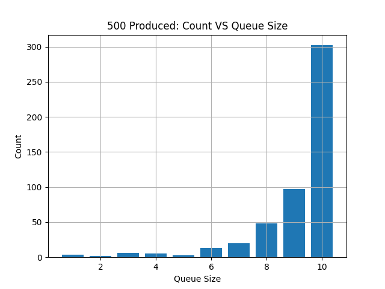

# Lesson 4 Prove: Factory and Dealership

### Overview

You will be using queue(s) and thread's with semaphore(s) to synchronize two threads in the production and selling of cars.

### Project Description

This assignment will contain two threaded classes. A `Factory` will create cars and a `Dealership` will retrieve them to be sold. There is a limit on the number of cars that a dealership can handle at a time. This is the `MAX_QUEUE_SIZE` variable. Therefore, if the dealership is full of cars, the Factory must wait to produce cars until some cars are sold.

### Assignment

The [prove.py](../prove/prove.py) file for this lesson contains the following classes:

**Car**: This is the car that the factory will create. When a car is created, it randomly selects a make, model and year.

**Factory**: This threaded class creates the cars for the dealerships. After a car is created, the factory uses a short delay between creating another one.

**Dealer**: This is the dealership it retrieves cars created by the factory to be sold. After a car is received, the dealership uses a short delay to sell the car. The dealership only has room for 10 cars, therefore, if the dealership is full, the factory must wait until a car is sold before creating another car.

**Queue251**: This is a queue that must be used in the assignment.

### Instructions

- Implement your code where the TODO comments are found.
- No global variables, all data must be passed to the objects.
- Only the already included/imported packages are allowed. 
- Thread pools are not allowed.
- Do not use try except statements in this assignment.
- **You are not allowed to use the normal Python Queue class.** You must use Queue251. This shared queue holds the Car objects and can not be greater than MAX_QUEUE_SIZE while your program is running.
- Your goal is to create `CARS_TO_PRODUCE` many cars. The Dealer thread must not know how many cars will be produced by the factory.
- You will need two semaphores to properly implement this assignment. Don't use a Bounded Semaphore. Do not use any arguments for the method acquire() when using semaphores. Also, when using semaphores, do not use the **_value** attribute.

Here is an example of the final log you should have for this assignment (your wording may/will differ):

```
21:31:33| Factory created: Ford Tall, 1999
21:31:33| Dealership sold: Ford Tall, 1999
21:31:33| Factory created: Jeep SXE, 1994
21:31:33| Dealership sold: Jeep SXE, 1994
21:31:33| Factory created: Chevrolet Flat, 1995
21:31:33| Dealership sold: Chevrolet Flat, 1995
21:31:33| Factory created: Nissan Titan, 2016
...
21:31:39| Dealership sold: Dodge M1, 2004
21:31:39| Factory created: Ford GX, 1997
21:31:39| Factory created: Toyota Charger, 2003
21:31:39| Dealership sold: Ford GX, 1997
21:31:39| Dealership sold: Toyota Charger, 2003
21:31:39| All 500 cars have been created and sold. = 6.03353810
```

### Plot Created by Your Program 

**After** the Dealership takes a car from the queue, it uses `size()` to get the size of the queue and updates the `queue_stats` list. Here is an example of a plot (Your plot might/will look different). Each bar represents the size of the queue while the program is running. From this plot, the program had a full queue of size 10 during most of the execution time.




### Rubric

Assignments are not accepted late. Instead, you should submit what you have completed by the due date for partial credit. Assignments are individual and not team based. Any assignments found to be plagiarized will be graded according to the `ACADEMIC HONESTY` section in the syllabus. The Assignment will be graded in broad categories as outlined in the syllabus.

### Submission

When finished, upload your Python file, chart, and log to Canvas.